# "Notimed"
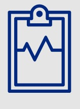
### Características principales

- Se siguió la arquitectura Model, View, ViewModel (MVVM).

- Adaptable en dispositivos moviles con sistema operativo de android en su version 5.0 (Android Lollipop) en adelante.

- Admite entrada de datos de tipo fecha, hora, numeros enteros y cadenas de texto

-Los textos indicativos de la aplicación aparecerán en inglés o español según el idioma en el que esté configurado el dispositivo en el que se corre la aplicación

- Se utilizaron componentes de material.io con la finalidad de brindar una mejor experiencia visual al usuario y un mejor manejo de los datos ingresados por el usuario dentro de la aplicación. Los componentes utilizados mayormente fueron:
	- DatePicker
	- TimePicker
	- TextLayout

- Las representaciones de los recordatorios, citas médicas o contactos médicos que el usuario cree, son basadas en CardViews las cuales funcionan como constructores para la presentación de los datos almacenados en la base de datos 

- Permite conexión con la API de Notimed, dicho lo cual, los datos ingresados por el usuario no son almacenados en el almacenamiento del dispositivo donde se ejecuta la aplicación Notimed, sino que son almacenados en la base de datos relacionada con la API.

- La aplicación se desarrolló en Kotlin.

# 1. App móvil
La aplicación móvil Notimed está disponible para sistema operativo Android en la página promocional de la misma. 
Para acceder al menú de la aplicación el usuario podrá registrarse desde la aplicación móvil. El correo con el que se cree el usuario será único por lo cual solo se podrá vincular una cuenta por correo  electronico registrado, dicho lo anterior, se mantedrá iniciada la sesión de unicamente un usuario durante  el uso de la aplicación, si se desea utilizar la aplicación en el mismo dispositivo pero con diferentes usuarios, se deberá cerrar sesión con el usuario actual para que el usuario a utilizar la aplicación  pueda acceder a sus datos dentro de la aplicación.

## 1.1. Login
### 1.1.1. Inicio de sesión
la apllicacion mostrará un formulario el cual el usuario debera completar para poder acceder a su perfil creado en la aplicación de Notimed. El formulario tiene validaciones como campos vacíos o longitud de la cadena de texto ingresada
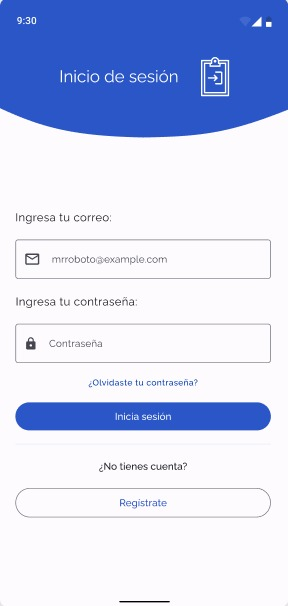

### 1.1.2. Registro de usuario
Si el usuario desea crear su perfil o el perfil de alguien mas, debera presionar el botón de "registrarse" el cual lo direccionará hacia un nuevo formulario donde debe ingresar sus datos, correo electronico a la que se vinculará la cuenta y su debida contraseña. Luego de completar el formulario, el usuario deberá presionar el botón de "guardar" y la aplicación lo direccionará hacia el fragmento de "inicio de sesión". El formulario tiene validaciones como campos vacíos o longitud de la cadena de texto ingresada
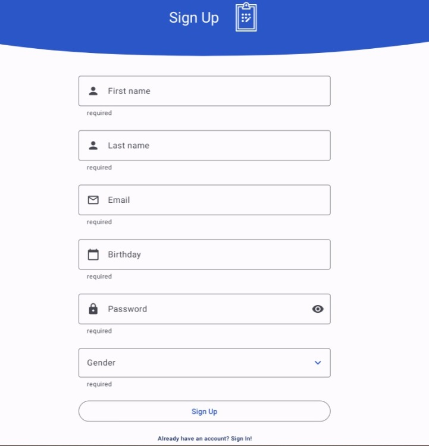
### 1.1.3 Recuperar contraseña
Si el usuario desea recuperar acceso a su cuenta, al presionar el texto "recuperar contraseña" lo enviará a un fragmento que le solicitará, por medio de un formulario, su correo electronico al cual se le enviará un correo que contendrá el link al que el usuario ingresará para definir una nueva contraseña

## 1.2. Menú principal
Al comprobar las credenciales del usuario, la aplicación enviará al usuario a un fragmento el cual será el menú, ahí se mostrarán cuatro (4) botones los cuales especifican las acciones que puede realizar el usuario, además de ellos, se muestra un saludo al usuario que utiliza el nombre que el usuario guardó.
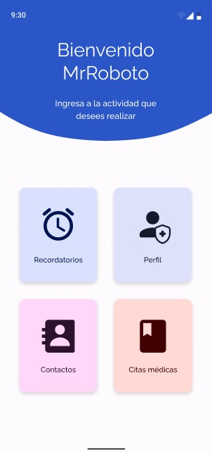

## 1.3. Recordatorios
Al presionar el botón de recordatorios la aplicación enviará al usuario hacia el fragmento "recordatorios" en el cual se mostrarán los recordatorios de medicamentos que el usuario ha ingresado en la aplicación, además de un botón ubicado en la esquina inferior derecha donde se puede agregar más recordatorios.
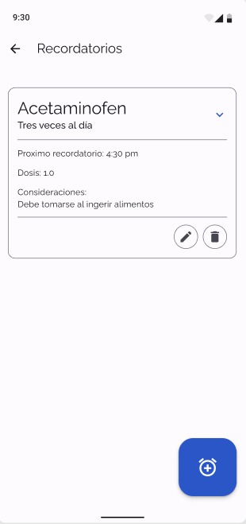
### 1.3.1 Nuevo recordatorio
Al presionar el botón para agregar recordatorios médicos, la aplicación mostrará un fragmento donde estará un formulario con los datos requeridos para guardar un recordatorio médico, al final del mismo, se mostrarán dos botones, uno para guardar y el otro para cancelar el formulario actual. Al presionar el botón "Guardar" se hará un post en la base de datos, especificamente en recordatorios y enviará al usuario al fragmento de recordatorios médicos, donde se mostrará la tarjeta recién creada, mientras que al presionar el botón "Cancelar" no se enviará nada a la base de datos y enviará al usuario al fragmento de recordatorios médicos donde visualizará que ninguna tarjeta se ha creado (relacionadas al formulario cancelado).
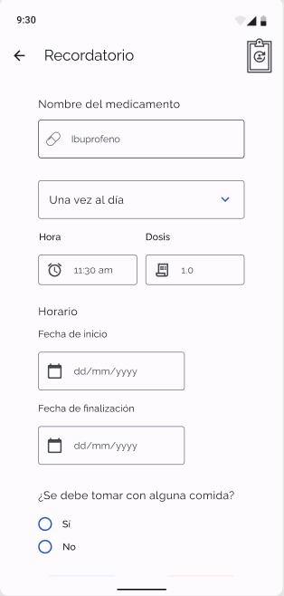
## 1.4. Citas médicas
Al presionar el botón de citas médicas la aplicación enviará al usuario hacia el fragmento "citas médicas" en el cual se mostrarán las citas médicas que el usuario ha ingresado en la aplicación, además de un botón ubicado en la esquina inferior derecha donde se puede agregar más citas médicas.
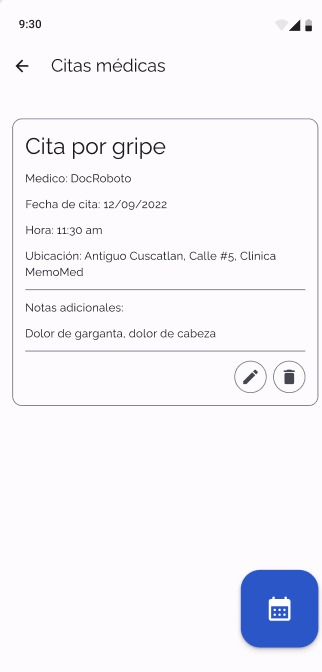
### 1.4.1 Nueva cita médica
Al presionar el botón para agregar citas médicas, la aplicación mostrará un fragmento donde estará un formulario con los datos requeridos para guardar una cita médica, al final del mismo, se mostrarán dos botones, uno para guardar y el otro para cancelar el formulario actual. Al presionar el botón "Guardar" se hará un post en la base de datos, especificamente en citas médicas y enviará al usuario al fragmento de citas médicas, donde se mostrará la tarjeta recién creada, mientras que al presionar el botón "Cancelar" no se enviará nada a la base de datos y enviará al usuario al fragmento de citas médicas donde visualizará que ninguna tarjeta se ha creado (relacionadas al formulario cancelado).
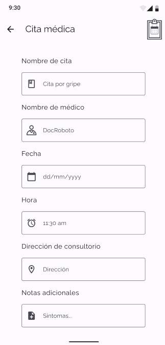

## 1.5. Contactos médicos
Al presionar el botón de contactos médicos la aplicación enviará al usuario hacia el fragmento "contactos médicos" en el cual se mostrarán los contactos médicos que el usuario ha ingresado en la aplicación, además de un botón ubicado en la esquina inferior derecha donde se puede agregar más contactos.
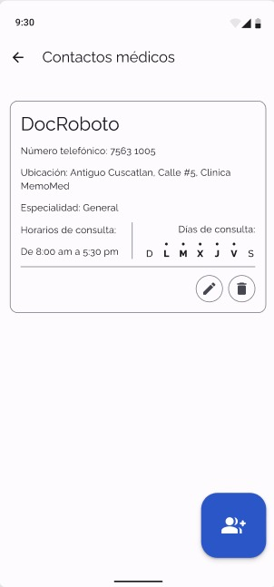
### 1.5.1 Nuevo contacto médico
Al presionar el botón para agregar contactos médicos, la aplicación mostrará un fragmento donde estará un formulario con los datos requeridos para guardar un contacto médico, al final del mismo, se mostrarán dos botones, uno para guardar y el otro para cancelar el formulario actual. Al presionar el botón "Guardar" se hará un post en la base de datos, especificamente en contactos y enviará al usuario al fragmento de contactos médicos, donde se mostrará la tarjeta recién creada, mientras que al presionar el botón "Cancelar" no se enviará nada a la base de datos y enviará al usuario al fragmento de contactos médicos donde visualizará que ninguna tarjeta se ha creado (relacionadas al formulario cancelado).
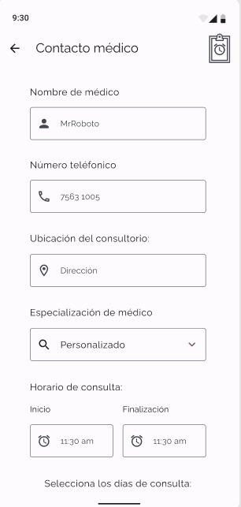
## 1.6. Tarjetas de datos
Las tarjetas donde se mostrarán los datos de recordatorios, citas médicas y contactos médicos tendrán cada una dos botones ubicados en la esquina inferior derecha de la tarjeta, los cuales son para editar esa tarjeta en específico o eliminar esa tarjeta en específico

### 1.6.1 Botón editar
Al presionar este botón al usuario se le mostrará un nuevo formulario con los datos de la tarjeta que desea actualizar, el formulario permite editar los campos de la tarjeta que el usuario desee, luego aparecen los mismos botones de guardar y cancelar como en el formulario principal.

### 1.6.2 Botón eliminar
Al presionar este botón se mostrará una alerta al usuario la cual le preguntará si realmente desea eliminar la tarjeta seleccionada, al usuario se le presentan dos opciones; cancelar el eliminar la tarjeta o aceptar la eliminación de la tarjeta, al presionar cancelar, la tarjeta se seguirá mostrando al usuario, por el contrario si acepta el eliminar la tarjeta, los datos de esa tarjeta se eliminan de la base de datos y no se le mostrará esa tarjeta al usuario.

## 1.7. Perfil
Al presionar el botón de perfil en el menú principal, se le mostrará al usuario un fragmento en el que se mostrarán datos como su nombre, fecha de nacimiento y su correo electronico. Además se le mostrará dos botones en la parte superior derecho del fragmento, el cual contendrá los botones editar y cerrar sesión
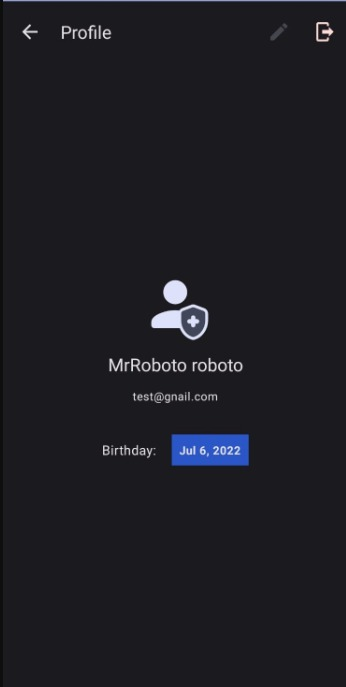

### 1.7.1 Editar
Se le mostrará al usuario un formulario con los datos guardados sobre el usuario, donde se puede elegir modificar entre el nombre, correo y su fecha de nacimiento, luego aparecerán los mismos botones de guardar y cancelar 

### 1.7.2 Cerrar sesión
Esto hará que la sesión actual dentro de la aplicación se cierre y enviará al usuario al fragmento de iniciar sesión
